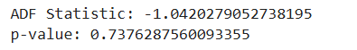
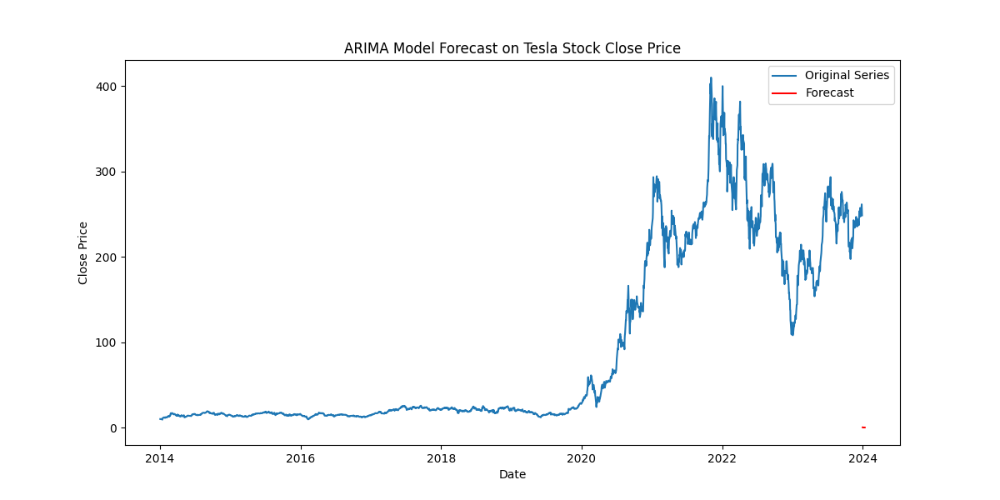
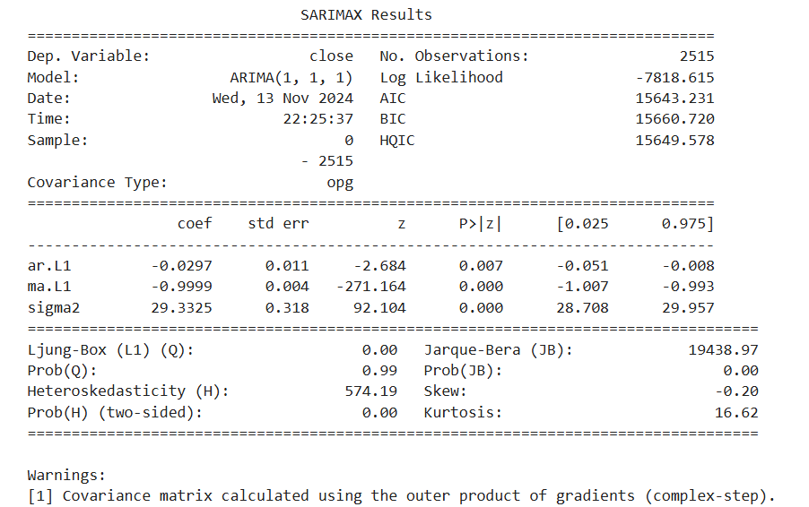
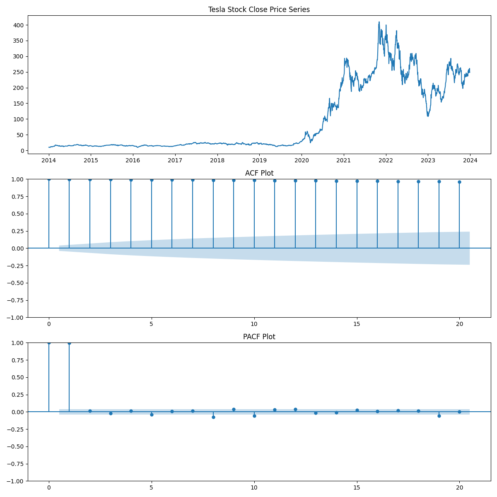

# EX.NO.09        A project on Time series analysis on weather forecasting using ARIMA model 
 

### AIM:
To Create a project on Time series analysis on weather forecasting using ARIMA model in  Python and compare with other models.
### ALGORITHM:
1. Explore the dataset of weather 
2. Check for stationarity of time series time series plot
   ACF plot and PACF plot
   ADF test
   Transform to stationary: differencing
3. Determine ARIMA models parameters p, q
4. Fit the ARIMA model
5. Make time series predictions
6. Auto-fit the ARIMA model
7. Evaluate model predictions
### PROGRAM:
```python
import pandas as pd
from statsmodels.tsa.arima.model import ARIMA
import matplotlib.pyplot as plt
from statsmodels.tsa.stattools import adfuller
from statsmodels.graphics.tsaplots import plot_acf, plot_pacf

# Load the Tesla stock data
file_path = '/mnt/data/tsla_2014_2023.csv'
data = pd.read_csv(file_path)

# Convert 'date' column to datetime and set as index
data['date'] = pd.to_datetime(data['date'])
data.set_index('date', inplace=True)
series = data['close']

# Perform Augmented Dickey-Fuller test
result = adfuller(series)
print(f'ADF Statistic: {result[0]}')
print(f'p-value: {result[1]}')

# Plot the time series, ACF, and PACF, and save as an image
plt.figure(figsize=(12, 12))
plt.subplot(311)
plt.plot(series)
plt.title("Tesla Stock Close Price Series")

plt.subplot(312)
plot_acf(series, ax=plt.gca(), lags=20)
plt.title("ACF Plot")

plt.subplot(313)
plot_pacf(series, ax=plt.gca(), lags=20)
plt.title("PACF Plot")
plt.tight_layout()
plt.savefig('/mnt/data/tesla_acf_pacf.png')
plt.show()

# Check if differencing is needed based on the p-value
if result[1] > 0.05:
    series_diff = series.diff().dropna()
else:
    series_diff = series

# Fit an ARIMA model and display the summary
model = ARIMA(series_diff, order=(1, 1, 1))
model_fit = model.fit()
print(model_fit.summary())

# Forecast the next 10 days
forecast_steps = 10
forecast = model_fit.forecast(steps=forecast_steps)

# Create a new index for the forecasted values
forecast_index = pd.date_range(start=series.index[-1] + pd.Timedelta(days=1), periods=forecast_steps, freq='B')

# Plot the original series and forecast, then save as an image
plt.figure(figsize=(12, 6))
plt.plot(series, label="Original Series")
plt.plot(forecast_index, forecast, label="Forecast", color='red')
plt.title("ARIMA Model Forecast on Tesla Stock Close Price")
plt.xlabel("Date")
plt.ylabel("Close Price")
plt.legend()
plt.savefig('/mnt/data/tesla_forecast.png')
plt.show()

```

### OUTPUT:





### RESULT:
Thus the program run successfully based on the ARIMA model using python.
